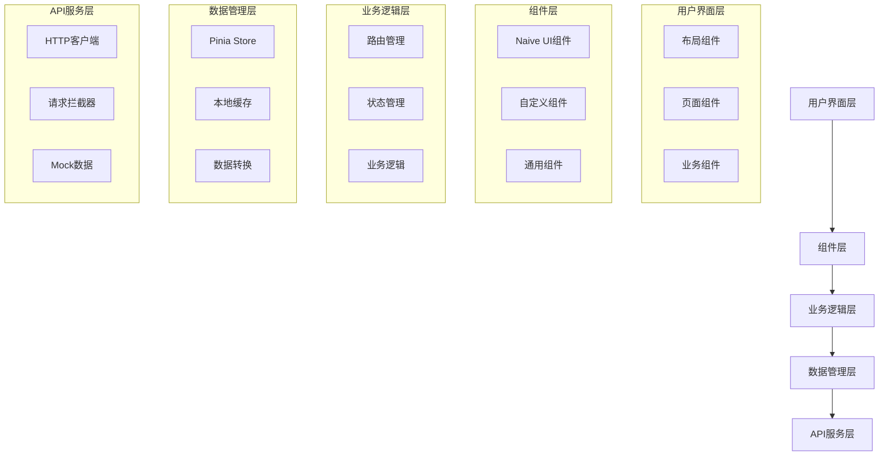
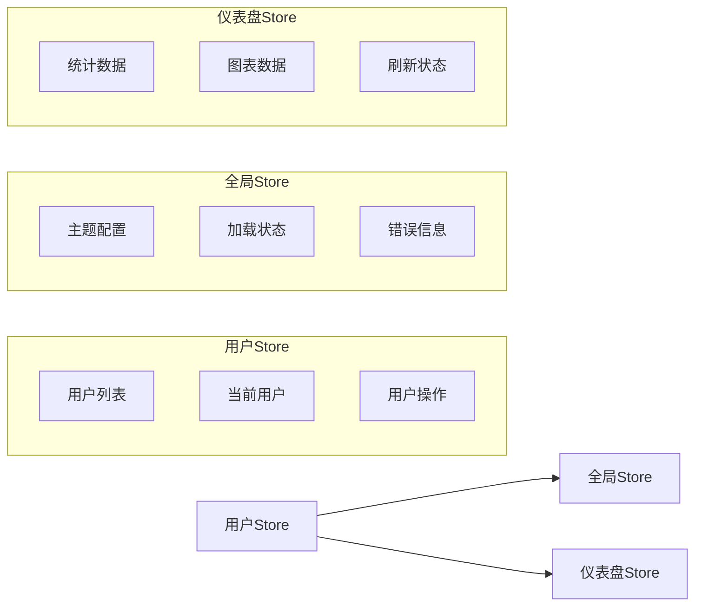
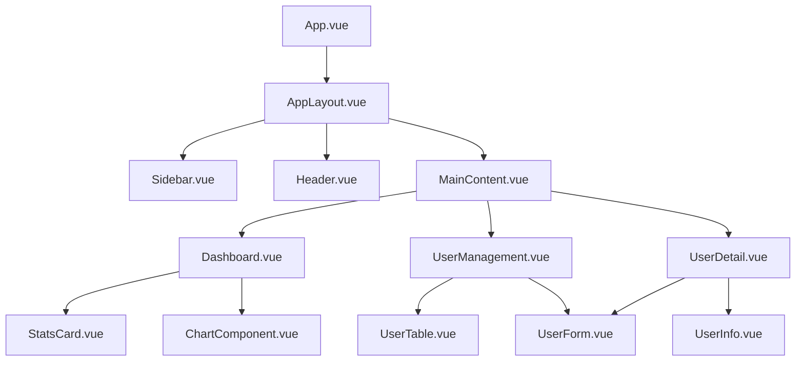
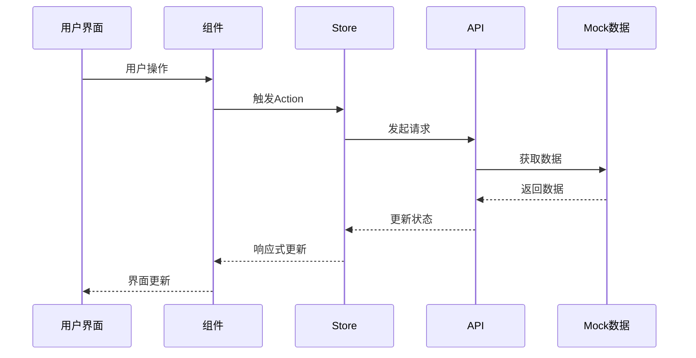

# DESIGN - GPU云算力租借平台平台后台管理系统架构设计

## 整体架构图



## 分层设计和核心组件

### 1. 用户界面层

**布局组件**：

- `AppLayout.vue` - 主布局容器
- `Sidebar.vue` - 侧边栏导航
- `Header.vue` - 顶部导航栏
- `MainContent.vue` - 内容区域

**页面组件**：

- `Dashboard.vue` - 仪表盘页面
- `UserManagement.vue` - 用户管理页面
- `UserDetail.vue` - 用户详情页面

**业务组件**：

- `StatsCard.vue` - 数据卡片组件
- `UserTable.vue` - 用户表格组件
- `UserForm.vue` - 用户表单组件

### 2. 状态管理设计



### 3. 组件依赖关系图



## 接口契约定义

### API接口规范

```typescript
// 用户相关接口
interface UserAPI {
  // 获取用户列表
  getUsers(params: UserListParams): Promise<UserListResponse>

  // 获取用户详情
  getUserById(id: string): Promise<UserDetailResponse>

  // 创建用户
  createUser(data: CreateUserData): Promise<UserResponse>

  // 更新用户
  updateUser(id: string, data: UpdateUserData): Promise<UserResponse>

  // 删除用户
  deleteUser(id: string): Promise<void>
}

// 仪表盘接口
interface DashboardAPI {
  // 获取统计数据
  getStats(): Promise<StatsResponse>

  // 获取图表数据
  getChartData(type: ChartType): Promise<ChartDataResponse>
}
```

### 数据类型定义

```typescript
// 用户数据类型
interface User {
  id: string
  username: string
  email: string
  avatar?: string
  status: 'active' | 'inactive'
  role: 'admin' | 'user'
  createdAt: string
  lastLogin?: string
}

// 统计数据类型
interface Stats {
  totalRevenue: number
  totalUsers: number
  activeInstances: number
  cpuUsage: number
  memoryUsage: number
}

// 图表数据类型
interface ChartData {
  labels: string[]
  datasets: {
    label: string
    data: number[]
    backgroundColor?: string
    borderColor?: string
  }[]
}
```

## 数据流向图



## 主题配置系统

### 设计Token配置

```typescript
interface ThemeConfig {
  colors: {
    primary: string
    success: string
    warning: string
    error: string
    info: string
  }

  spacing: {
    xs: string
    sm: string
    md: string
    lg: string
    xl: string
  }

  borderRadius: {
    sm: string
    md: string
    lg: string
  }

  shadows: {
    sm: string
    md: string
    lg: string
  }
}
```

## 异常处理策略

### 1. 全局错误处理

- HTTP请求错误统一拦截
- 全局错误状态管理
- 用户友好的错误提示

### 2. 组件级错误处理

- 数据加载失败处理
- 表单验证错误处理
- 操作失败反馈

### 3. 网络错误处理

- 请求超时处理
- 网络连接失败处理
- 服务器错误处理

## 目录结构设计

```
src/
├── api/                 # API接口层
│   ├── types.ts        # API类型定义
│   ├── user.ts         # 用户相关API
│   ├── dashboard.ts    # 仪表盘API
│   └── http.ts         # HTTP客户端配置
├── components/          # 组件层
│   ├── common/         # 通用组件
│   ├── layout/         # 布局组件
│   └── business/       # 业务组件
├── stores/             # 状态管理
│   ├── user.ts         # 用户状态
│   ├── dashboard.ts    # 仪表盘状态
│   └── global.ts       # 全局状态
├── views/              # 页面组件
│   ├── Dashboard.vue   # 仪表盘
│   ├── UserManagement.vue # 用户管理
│   └── UserDetail.vue  # 用户详情
├── router/             # 路由配置
├── styles/             # 样式文件
│   ├── theme.ts        # 主题配置
│   └── global.css      # 全局样式
├── utils/              # 工具函数
└── mock/               # Mock数据
```

## 性能优化策略

### 1. 代码分割

- 路由级别代码分割
- 组件按需加载
- 第三方库按需引入

### 2. 状态管理优化

- 合理的状态粒度
- 避免不必要的响应式更新
- 数据缓存策略

### 3. 渲染优化

- 虚拟滚动（大列表）
- 图片懒加载
- 防抖节流处理

## 设计验证

### 架构合理性

- ✅ 分层清晰，职责明确
- ✅ 组件解耦，复用性好
- ✅ 状态管理合理
- ✅ 错误处理完善

### 可扩展性

- ✅ 新功能模块易于添加
- ✅ 组件易于复用和扩展
- ✅ API接口设计灵活
- ✅ 主题系统可定制

### 可维护性

- ✅ 代码结构清晰
- ✅ 类型定义完整
- ✅ 错误处理统一
- ✅ 文档完善
