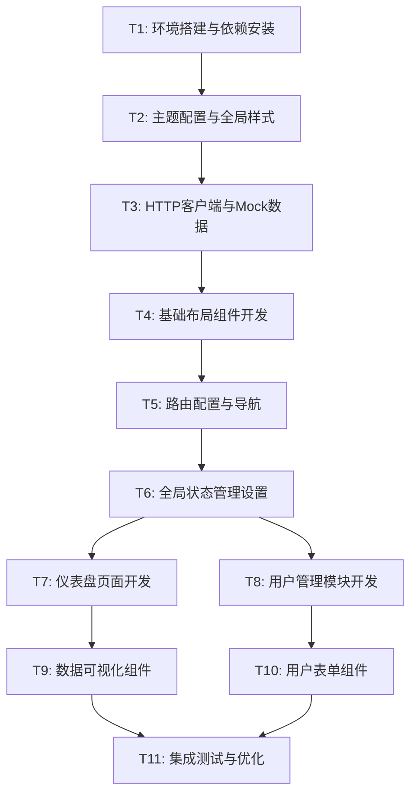

# TASK - GPU云算力租借平台平台后台管理系统任务分解

## 任务依赖图

## 原子任务详细定义

### T1: 环境搭建与依赖安装

**输入契约**：

- 前置依赖：项目已成功运行
- 输入数据：package.json配置
- 环境依赖：Node.js, Yarn

**输出契约**：

- 输出数据：更新的package.json, yarn.lock
- 交付物：Naive UI及相关依赖安装完成
- 验收标准：
  - Naive UI成功安装
  - 相关图标库和工具库安装
  - 项目编译无错误

**实现约束**：

- 技术栈：保持现有Vue 3 + Vite + TS
- 接口规范：使用Naive UI官方API

- 质量要求：依赖版本稳定

**依赖关系**：

- 后置任务：T2
- 并行任务：无

---

### T2: 主题配置与全局样式

**输入契约**：

- 前置依赖：T1完成，Naive UI可用
- 输入数据：设计规范（色彩、字体、圆角等）
- 环境依赖：Naive UI主题系统

**输出契约**：

- 输出数据：主题配置文件
- 交付物：
  - `src/styles/theme.ts` - 主题配置
  - `src/styles/global.css` - 全局样式
  - 主题提供器配置

- 验收标准：
  - 主色调为#3B82F6
  - 全局字体、圆角、阴影符合设计规范
  - 暗色模式基础支持

**实现约束**：

- 技术栈：Naive UI主题系统
- 接口规范：符合Naive UI ThemeConfig类型
- 质量要求：类型安全，可复用

**依赖关系**：

- 前置任务：T1

- 后置任务：T3, T4
- 并行任务：无

---

### T3: HTTP客户端与Mock数据

**输入契约**：

- 前置依赖：T2完成，基础环境可用
- 输入数据：API接口规范
- 环境依赖：Axios库

**输出契约**：

- 输出数据：HTTP客户端实例，Mock数据
- 交付物：
  - `src/api/http.ts` - HTTP客户端配置
  - `src/api/types.ts` - API类型定义

  - `src/mock/` - Mock数据文件
  - `src/api/user.ts` - 用户API
  - `src/api/dashboard.ts` - 仪表盘API

- 验收标准：
  - 请求拦截器配置完成

  - 错误处理统一
  - Mock数据结构完整
  - TypeScript类型定义准确

**实现约束**：

- 技术栈：Axios + TypeScript
- 接口规范：RESTful API设计
- 质量要求：错误处理完善，类型安全

**依赖关系**：

- 前置任务：T2
- 后置任务：T6, T7, T8

- 并行任务：T4

---

### T4: 基础布局组件开发

**输入契约**：

- 前置依赖：T2完成，主题可用
- 输入数据：布局设计规范
- 环境依赖：Naive UI组件库

**输出契约**：

- 输出数据：布局组件代码
- 交付物：
  - `src/components/layout/AppLayout.vue` - 主布局
  - `src/components/layout/Sidebar.vue` - 侧边栏

  - `src/components/layout/Header.vue` - 顶栏
  - `src/components/layout/MainContent.vue` - 内容区

- 验收标准：
  - 响应式布局正常
  - 侧边栏收缩功能
  - 面包屑导航
  - 适配1440px+分辨率

**实现约束**：

- 技术栈：Vue 3 Composition API + Naive UI
- 接口规范：Props类型定义完整
- 质量要求：组件复用性好，性能优秀

**依赖关系**：

- 前置任务：T2
- 后置任务：T5
- 并行任务：T3

---

### T5: 路由配置与导航

**输入契约**：

- 前置依赖：T4完成，布局组件可用
- 输入数据：页面路由规划
- 环境依赖：Vue Router

**输出契约**：

- 输出数据：路由配置文件
- 交付物：
  - 更新`src/router/index.ts` - 路由配置
  - 导航菜单配置
  - 路由守卫基础配置
- 验收标准：
  - 嵌套路由正确
  - 导航高亮正常

  - 面包屑自动生成
  - 路由懒加载

**实现约束**：

- 技术栈：Vue Router 4
- 接口规范：路由元信息完整
- 质量要求：代码分割，性能优化

**依赖关系**：

- 前置任务：T4
- 后置任务：T7, T8
- 并行任务：T6

---

### T6: 全局状态管理设置

**输入契约**：

- 前置依赖：T3完成，API可用

- 输入数据：状态管理设计
- 环境依赖：Pinia

**输出契约**：

- 输出数据：Store文件
- 交付物：
  - `src/stores/global.ts` - 全局状态
  - `src/stores/user.ts` - 用户状态

  - `src/stores/dashboard.ts` - 仪表盘状态

- 验收标准：
  - 状态类型定义完整
  - Actions异步处理正确
  - 错误状态管理

  - 加载状态处理

**实现约束**：

- 技术栈：Pinia + TypeScript
- 接口规范：Store类型安全
- 质量要求：状态设计合理，性能优秀

**依赖关系**：

- 前置任务：T3
- 后置任务：T7, T8

- 并行任务：T5

---

### T7: 仪表盘页面开发

**输入契约**：

- 前置依赖：T5, T6完成，路由和状态管理可用
- 输入数据：仪表盘设计稿，数据格式
- 环境依赖：图表库（如ECharts）

**输出契约**：

- 输出数据：仪表盘页面组件
- 交付物：
  - `src/views/Dashboard.vue` - 仪表盘页面
  - `src/components/business/StatsCard.vue` - 统计卡片
  - 基础图表组件

- 验收标准：
  - 数据卡片显示正常
  - 图表渲染正确
  - 加载状态完善
  - 响应式设计良好

**实现约束**：

- 技术栈：Vue 3 + Naive UI + 图表库
- 接口规范：组件Props和Emits类型化
- 质量要求：性能优秀，用户体验佳

**依赖关系**：

- 前置任务：T5, T6
- 后置任务：T9
- 并行任务：T8

---

### T8: 用户管理模块开发

**输入契约**：

- 前置依赖：T5, T6完成，路由和状态管理可用
- 输入数据：用户管理功能规范

- 环境依赖：表格和表单组件

**输出契约**：

- 输出数据：用户管理页面组件

- 交付物：
  - `src/views/UserManagement.vue` - 用户管理页
  - `src/views/UserDetail.vue` - 用户详情页
  - `src/components/business/UserTable.vue` - 用户表格
- 验收标准：
  - 用户列表分页搜索正常
  - 用户创建编辑功能完整
  - 状态管理操作正确
  - 表单验证完善

**实现约束**：

- 技术栈：Vue 3 + Naive UI
- 接口规范：CRUD操作规范
- 质量要求：数据一致性，操作反馈及时

**依赖关系**：

- 前置任务：T5, T6
- 后置任务：T10
- 并行任务：T7

---

### T9: 数据可视化组件

**输入契约**：

- 前置依赖：T7完成，仪表盘基础可用
- 输入数据：图表数据格式
- 环境依赖：ECharts或其他图表库

**输出契约**：

- 输出数据：图表组件
- 交付物：
  - `src/components/common/ChartComponent.vue` - 通用图表
  - 收入趋势图组件
  - 使用率图表组件
- 验收标准：
  - 图表渲染性能良好
  - 数据更新响应及时
  - 图表交互功能正常

  - 响应式适配

**实现约束**：

- 技术栈：Vue 3 + 图表库

- 接口规范：图表配置类型化
- 质量要求：性能优秀，视觉美观

**依赖关系**：

- 前置任务：T7
- 后置任务：T11
- 并行任务：T10

---

### T10: 用户表单组件

**输入契约**：

- 前置依赖：T8完成，用户管理基础可用
- 输入数据：用户表单字段规范
- 环境依赖：表单验证库

**输出契约**：

- 输出数据：用户表单组件
- 交付物：
  - `src/components/business/UserForm.vue` - 用户表单
  - 表单验证规则
  - 用户信息展示组件

- 验收标准：
  - 表单验证规则完整
  - 提交处理正确
  - 错误提示友好
  - 表单重置功能

**实现约束**：

- 技术栈：Vue 3 + Naive UI表单
- 接口规范：表单数据类型安全
- 质量要求：用户体验佳，验证完善

**依赖关系**：

- 前置任务：T8
- 后置任务：T11

- 并行任务：T9

---

### T11: 集成测试与优化

**输入契约**：

- 前置依赖：T9, T10完成，所有功能模块可用
- 输入数据：完整应用
- 环境依赖：测试环境

**输出契约**：

- 输出数据：测试报告，优化后的应用
- 交付物：
  - 性能优化代码
  - 错误处理完善
  - 用户体验优化
- 验收标准：
  - 所有功能正常工作
  - 性能指标达标
  - 错误处理完善
  - 用户体验流畅

**实现约束**：

- 技术栈：现有技术栈
- 接口规范：保持现有规范
- 质量要求：生产就绪

**依赖关系**：

- 前置任务：T9, T10
- 后置任务：无
- 并行任务：无

## 复杂度评估

- **简单任务** (1-2天): T1, T2, T5
- **中等任务** (2-3天): T3, T4, T6, T9, T10
- **复杂任务** (3-4天): T7, T8, T11

## 总体时间估算

**预计总工期**: 15-20个工作日
**关键路径**: T1 → T2 → T3 → T6 → T8 → T10 → T11
