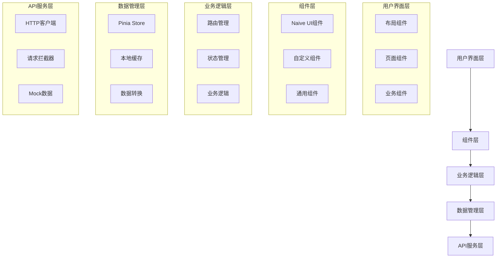
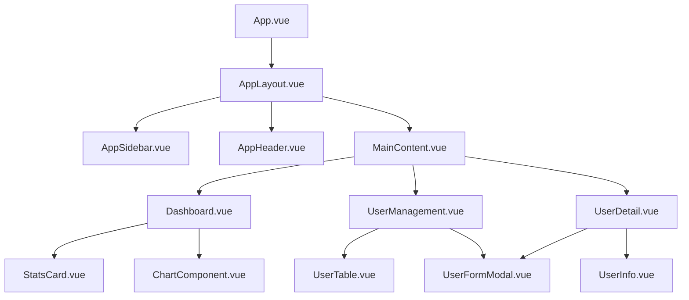
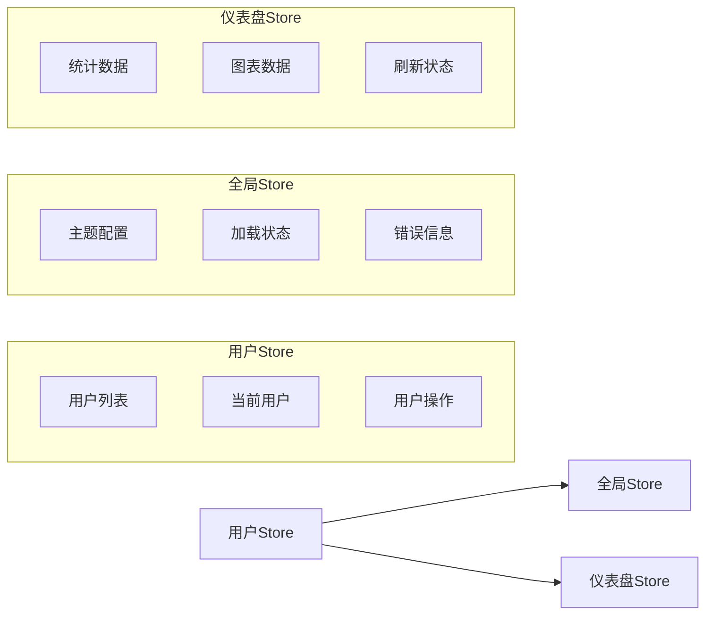
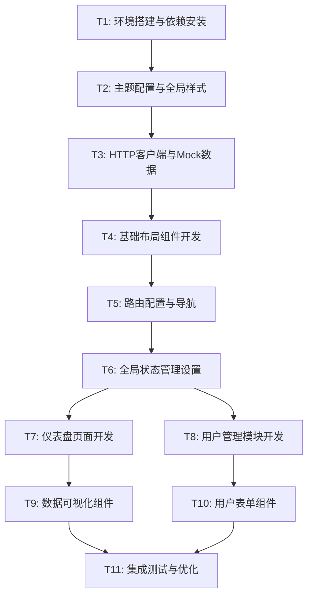

# GPU租借平台后台管理系统 - 完整项目文档

## 📋 目录

1. [项目概述](#项目概述)
2. [技术方案](#技术方案)
3. [系统架构设计](#系统架构设计)
4. [开发任务分解](#开发任务分解)
5. [当前进度状态](#当前进度状态)
6. [待办事项](#待办事项)
7. [开发指南](#开发指南)

---

## 项目概述

### 项目愿景

构建一个**高级、现代、专业**的GPU租借平台后台管理系统，为内部管理员和运营人员提供**视觉卓越、体验流畅**的管理界面。

### 核心功能模块

1. **仪表盘模块** 📊
   - 数据概览卡片（收入、用户数、资源使用率）
   - 实时图表展示（收入趋势、用户增长、GPU使用率）
   - 快捷操作入口

2. **用户管理模块** 👥
   - 用户列表（搜索、筛选、分页）
   - 用户详情查看和编辑
   - 账户状态管理（启用/禁用）
   - 用户创建功能

3. **GPU实例管理模块** 🖥️
   - 服务器列表、配置管理、状态监控

4. **订单管理模块** 💰
   - 订单列表、详情、退款操作

5. **系统设置模块** ⚙️
   - 基础配置、费率管理

### 项目边界

**✅ 包含范围：**

- 前端界面开发（Vue 3 + TypeScript）
- UI组件库集成和主题定制
- 基础布局和路由系统
- 核心模块详细实现
- HTTP请求封装和状态管理

**❌ 不包含范围：**

- 后端API实现（使用Mock数据）
- 部署和运维配置
- 完整的所有模块实现（仅实现示例模块）

---

## 技术方案

### 技术栈

- **框架**: Vue 3.4.21 + Vite 5.1.6
- **语言**: TypeScript 5.4.0
- **路由**: Vue Router 4.3.0
- **状态管理**: Pinia 2.1.7
- **UI组件库**: Naive UI 2.43.1
- **图标库**: @vicons/ionicons5
- **HTTP客户端**: Axios
- **图表库**: ECharts + Vue-ECharts
- **开发工具**: ESLint + Prettier + Vue TSC

### UI组件库选型：Naive UI

**选择依据：**

- 🎨 现代化设计风格，符合高端B2B产品要求
- 📝 TypeScript原生支持，开发体验优秀
- 🎭 主题定制灵活，易于实现指定设计规范
- ⚡ 组件质量高，API设计符合Vue 3理念

### 主题设计系统

#### 色彩系统

```typescript
// 主色调 - 科技蓝
primary: '#3B82F6'
primaryHover: '#2563EB'
primaryPressed: '#1D4ED8'

// 功能色彩
success: '#10B981' // 温和绿
warning: '#F59E0B' // 温暖橙
error: '#EF4444' // 柔和红
info: '#6B7280' // 中性灰

// 中性色阶
gray50: '#F8FAFC'
gray100: '#F1F5F9'
gray200: '#E2E8F0'
gray500: '#64748B'
gray900: '#0F172A'
```

#### 视觉规范

- **圆角**: 6px-8px
- **阴影**: 多层次柔和阴影
- **字体**: 系统无衬线字体栈
- **字号层级**: 12px, 14px, 16px, 18px, 24px

---

## 系统架构设计

### 整体架构图



### 组件依赖关系图



### 状态管理设计



### 目录结构设计

```
src/
├── api/                 # API接口层
│   ├── types.ts        # API类型定义
│   ├── user.ts         # 用户相关API
│   ├── dashboard.ts    # 仪表盘API
│   └── http.ts         # HTTP客户端配置
├── components/          # 组件层
│   ├── common/         # 通用组件
│   ├── layout/         # 布局组件
│   └── business/       # 业务组件
├── stores/             # 状态管理
│   ├── user.ts         # 用户状态
│   ├── dashboard.ts    # 仪表盘状态
│   └── global.ts       # 全局状态
├── views/              # 页面组件
│   ├── Dashboard.vue   # 仪表盘
│   ├── UserManagement.vue # 用户管理
│   └── UserDetail.vue  # 用户详情
├── router/             # 路由配置
├── styles/             # 样式文件
│   ├── theme.ts        # 主题配置
│   └── global.css      # 全局样式
├── utils/              # 工具函数
└── mock/               # Mock数据
```

---

## 开发任务分解

### 任务依赖图



### 任务详细说明

#### T1: 环境搭建与依赖安装 ✅

- 安装 Naive UI、图标库、Axios、ECharts
- 项目编译配置验证

#### T2: 主题配置与全局样式 ✅

- 创建设计系统配置文件
- 集成 Naive UI 主题配置
- 全局样式文件创建

#### T3: HTTP客户端与Mock数据 ✅

- HTTP客户端封装
- API类型定义
- Mock数据创建

#### T4: 基础布局组件开发 🔄

- 主布局组件（已完成）
- 侧边栏组件（已完成）
- **待完成**: AppHeader组件

#### T5: 路由配置与导航 ⏳

- 路由配置更新
- 导航菜单集成

#### T6: 全局状态管理设置 ⏳

- Pinia stores创建
- 全局状态定义

#### T7-T11: 业务模块开发 ⏳

- 仪表盘页面
- 用户管理模块
- 数据可视化
- 表单组件
- 集成测试

### 复杂度评估

- **简单任务** (1-2天): T1, T2, T5
- **中等任务** (2-3天): T3, T4, T6, T9, T10
- **复杂任务** (3-4天): T7, T8, T11

**预计总工期**: 15-20个工作日

---

## 当前进度状态

### ✅ 已完成任务

#### T1: 环境搭建与依赖安装

- ✅ 成功安装 Naive UI 2.43.1
- ✅ 安装图标库 @vicons/ionicons5
- ✅ 安装 Axios、ECharts、Vue-ECharts
- ✅ 项目编译通过，无错误

#### T2: 主题配置与全局样式

- ✅ 创建完整的设计系统配置 (`src/styles/theme.ts`)
- ✅ 创建全局样式文件 (`src/styles/global.css`)
- ✅ 集成 Naive UI 主题配置到 App.vue
- ✅ 支持亮色/暗色主题切换

#### T3: HTTP客户端与Mock数据

- ✅ 创建完整的API类型定义 (`src/api/types.ts`)
- ✅ 实现HTTP客户端 (`src/api/http.ts`)
- ✅ 创建Mock数据（100个用户，完整仪表盘数据）
- ✅ 实现API接口（用户API、仪表盘API）

#### T4: 基础布局组件开发 (进行中)

- ✅ 创建主布局组件 (`AppLayout.vue`)
- ✅ 创建侧边栏组件 (`AppSidebar.vue`)
- ✅ 创建头部组件 (`AppHeader.vue`) - 支持主题切换

### 📊 项目运行状态

- ✅ 开发服务器正常运行 (<http://localhost:5173>)
- ✅ 热重载功能正常
- ✅ TypeScript编译无错误
- ✅ Naive UI主题生效
- ✅ 主题切换功能正常

### 📈 架构完成度

- **UI框架集成**: 100% ✅
- **主题定制**: 100% ✅
- **API架构**: 100% ✅
- **Mock数据**: 100% ✅
- **基础布局**: 90% 🔄
- **路由配置**: 0% ⏳
- **状态管理**: 0% ⏳
- **业务模块**: 0% ⏳

---

## 待办事项

### 🚨 立即需要完成的任务

#### 1. 路由配置与页面创建 (优先级: 高)

```bash
src/router/index.ts                     # 路由配置
src/views/Dashboard.vue                 # 仪表盘页面
src/views/UserManagement.vue           # 用户管理页面
src/views/UserDetail.vue               # 用户详情页面
```

#### 2. Pinia状态管理设置 (优先级: 高)

```bash
src/stores/global.ts                    # 全局状态 (主题、加载状态)
src/stores/user.ts                      # 用户状态管理
src/stores/dashboard.ts                 # 仪表盘状态
```

#### 3. 仪表盘页面开发 (优先级: 高)

```bash
src/components/business/StatsCard.vue         # 统计卡片
src/components/common/ChartComponent.vue      # 图表组件 (基于ECharts)
```

**功能要求**:

- [ ] 4个统计卡片 (收入、用户、实例、增长率)
- [ ] 收入趋势图表
- [ ] 用户增长图表
- [ ] 实例使用率图表
- [ ] 数据自动刷新功能

#### 4. 用户管理模块开发 (优先级: 高)

```bash
src/components/business/UserTable.vue         # 用户列表表格
src/components/business/UserDetailCard.vue    # 用户详情卡片
```

**功能要求**:

- [ ] 用户列表 (搜索、筛选、分页)
- [ ] 用户创建/编辑表单（已完成 UserFormModal.vue）
- [ ] 用户详情查看
- [ ] 批量操作 (删除、状态修改)
- [ ] 用户状态管理 (启用/禁用)

### 🔧 技术配置和优化

#### 5. 环境变量配置

```bash
.env.development                        # 开发环境配置
.env.production                         # 生产环境配置
```

#### 6. 通用组件开发

```bash
src/components/common/LoadingSpinner.vue      # 全局加载组件
src/components/common/ErrorBoundary.vue       # 错误边界组件
src/components/common/EmptyState.vue          # 空状态组件
```

#### 7. 工具函数和常量

```bash
src/utils/format.ts                           # 格式化工具函数
src/utils/validate.ts                         # 表单验证工具
src/constants/index.ts                        # 全局常量定义
```

### ⚡ 性能和体验优化

- [ ] 路由级别代码分割
- [ ] 组件懒加载
- [ ] 图表库按需加载
- [ ] 移动端适配 (平板模式)
- [ ] 小屏幕下的侧边栏行为
- [ ] 表格的响应式设计

### 🎨 UI/UX完善

- [ ] 按钮点击反馈动画
- [ ] 页面切换过渡动画
- [ ] 表格行悬停效果
- [ ] 表单验证实时反馈
- [ ] 图表主题适配

---

## 开发指南

### 🚀 快速启动指南

#### 立即可以开始的工作 (按优先级排序)

1. **配置基础路由** (30分钟)

   ```typescript
   // 更新router/index.ts，添加基础路由
   ```

2. **创建Pinia状态** (45分钟)

   ```typescript
   // 创建全局状态、用户状态、仪表盘状态
   ```

3. **创建仪表盘页面骨架** (45分钟)

   ```vue
   <!-- 包含4个统计卡片的布局 -->
   ```

4. **实现统计卡片组件** (60分钟)

   ```vue
   <!-- 展示统计数据的卡片组件 -->
   ```

5. **创建用户管理页面** (90分钟)

   ```vue
   <!-- 用户列表表格和搜索功能 -->
   ```

### 📅 一天内可完成的里程碑

- ✅ 完整的导航系统
- ✅ 仪表盘基础功能
- ✅ 用户管理CRUD
- ✅ 响应式布局完善

### 💡 开发建议

1. **优先完成路由配置**: 建立完整的页面导航框架
2. **然后实现状态管理**: 为数据流动建立基础
3. **再做仪表盘**: 有了完整数据展示，成就感更强
4. **最后做用户管理**: 复杂度最高，但架构已经很清晰

### 🎯 验收标准

#### 功能验收

- ✅ UI库成功集成，主题定制完成
- ✅ 基础布局响应式正常，适配1440px+分辨率
- ✅ 仪表盘数据概览和图表正常显示
- ✅ 用户管理CRUD功能完整
- ✅ 所有异步操作有加载状态

#### 质量验收

- ✅ TypeScript类型安全，无编译错误
- ✅ 代码风格一致，通过ESLint检查
- ✅ 组件复用性良好，架构清晰
- ✅ 空状态和错误处理完善
- ✅ 交互反馈及时清晰

#### 视觉验收

- ✅ 符合现代化B2B/SaaS产品设计标准
- ✅ 界面简洁专业，信息层级清晰
- ✅ 色彩搭配协调，符合品牌调性
- ✅ 间距合理，具有良好的呼吸感

### 📝 项目启动命令

```bash
# 安装依赖
yarn

# 启动开发服务器
yarn dev

# 类型检查
npm run type-check

# 代码格式化
npm run lint

# 构建生产版本
npm run build
or
yarn build
```
